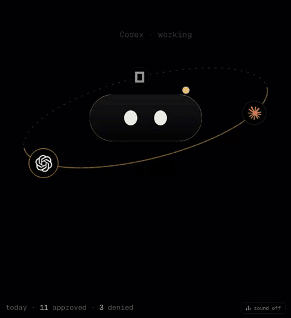
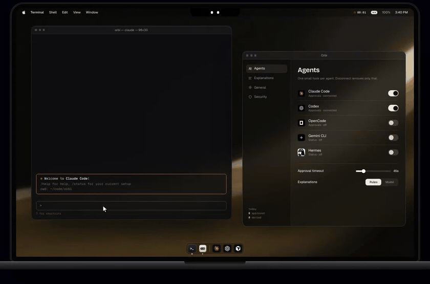

<p align="center">
  
</p>

<h1 align="center">Orbi</h1>

<p align="center"><b>Give your agent a face.</b></p>

<p align="center">
  <a href="https://orbi-xi-jet.vercel.app">Website</a> ·
  <a href="https://github.com/omyvnss/orbi/releases/latest">Download</a> ·
  <a href="#install">Install</a> ·
  <a href="#safety">Safety</a>
</p>

<p align="center">
  
</p>

Your coding agents ask for permission all day — run this, edit that, push
there. Most of us either rubber-stamp it or miss it in a terminal we weren't
looking at.

Orbi is a small face that lives in the notch at the top of your Mac. It
watches Claude Code, Codex, OpenCode, Gemini CLI, Cursor, Hermes or any script
you point at it. When one of them wants something, Orbi tells you in one plain
line what it wants and why it might matter — and you answer with one key,
without leaving what you're doing.

<p align="center">
  
</p>

**New in 0.2:** Orbi fits your real notch and hangs just below the camera,
tucks away when idle, lists your running sessions by project, shows Claude's
questions, jumps to the exact Terminal/iTerm tab, and shows exactly what Connect
will change before it changes anything. Size, width, height and position are
yours to set in Settings → Appearance.

| key | does |
| --- | --- |
| `⌃⌥A` | allow the request on screen |
| `⌃⌥D` | deny it |
| `⌃⌥O` | show / hide details (exact command, file, diff size) |
| `⌃⌥J` | jump to the terminal the agent runs in |

## Install

Free and open source. Needs macOS 13 or newer on an Apple Silicon Mac.

**1 · Download for Mac.** Grab `Orbi.dmg` from the
[latest release](https://github.com/omyvnss/orbi/releases/latest) or the
[website](https://orbi-xi-jet.vercel.app), drag **Orbi** into Applications and
open it. The build isn't notarized by Apple yet, so the first time macOS will
stop it: open **System Settings → Privacy & Security** and click **Open Anyway**
(or use the command below, which skips this).

**2 · Install with one command.** It checks the download against its SHA-256,
installs Orbi and opens it — no security prompt:

```sh
curl -fsSL https://orbi-xi-jet.vercel.app/install.sh | sh
```

**3 · Read the script first.** It's short on purpose:

```sh
curl -fsSLO https://orbi-xi-jet.vercel.app/install.sh
less install.sh
sh install.sh
```

Then: Settings opens on first launch → **Agents** → **Connect** the ones you
use. That's it. Settings is always one click away in the menu-bar icon (`⌘,`).

Everything is inside `Orbi.app`. The only other thing Orbi writes is its own
folder, `~/Library/Application Support/Orbi` (token, port, settings), plus the
small hook entry it adds to each agent's config when you press Connect.
Disconnect removes exactly that entry. API keys (optional) go in the Keychain.

## What works with what

| agent | approve / deny | status |
| --- | --- | --- |
| Claude Code | yes | yes |
| Codex | yes (trust Orbi's hooks once with `/hooks`) | yes |
| OpenCode | yes (via a small plugin Orbi writes) | yes |
| Gemini CLI, Cursor, Hermes | no — their hooks can block but not approve | yes |
| any script | `orbi-hook ask …` exits 0/1/2 | `orbi-hook event …` |

Details and the doc sources: `adapters/README.md`.

## Safety

- Orbi **never** approves anything by itself — only your `⌃⌥A` does, and only
  for a request that has been on screen long enough to read (a press that
  lands just as the request changes makes the face shake instead).
- No answer in time (45 s by default) → the agent's own prompt takes over. In
  Claude Code the terminal prompt shows at the same time; answer either one.
  Answer in the terminal and Orbi drops the request.
- Quit Orbi → the hook exits instantly; agents behave exactly as before. Delete
  Orbi.app → the hook entries turn into no-ops.
- Local only: `127.0.0.1`, a random token, a signed handshake so nothing else
  can pose as Orbi, browser requests refused. Orbi asks macOS to keep the face
  out of screen shares, but recent macOS versions can still capture it —
  quit Orbi before sharing a screen that might show a sensitive command.
- Optional BYOK explanations (Ollama, OpenRouter, OpenAI, any OpenAI-compatible
  endpoint) are off by default, and a model's line is only shown if it keeps
  the real command visible.
- Another hook that auto-approves tool calls (a `PreToolUse` hook returning
  `allow`) skips the permission step entirely, so Orbi never sees it.

## Develop

```sh
pnpm install
pnpm tauri dev              # builds the hook, runs the app
sh scripts/package.sh       # Orbi.app + dist-mac/Orbi.dmg
scripts/smoke.sh            # checks a running Orbi's server
cd web && python3 serve.py  # the landing page on :4310
```

Needs Rust and pnpm.

```text
src-tauri/   Rust: window, tray, hotkeys, server (server.rs, http.rs),
             settings, integrations, one-line explanations, BYOK
src/         React: the face, preview, details, Settings window
hook/        orbi-hook — the tiny binary agents call (bundled in the app)
web/         landing page (static, deployed on Vercel)
brand/       logo system: SVG marks, app icon, PNG exports, share images
docs/        APP.md (app contract), PROTOCOL.md (HTTP contract)
adapters/    per-agent notes
```

MIT licensed.
